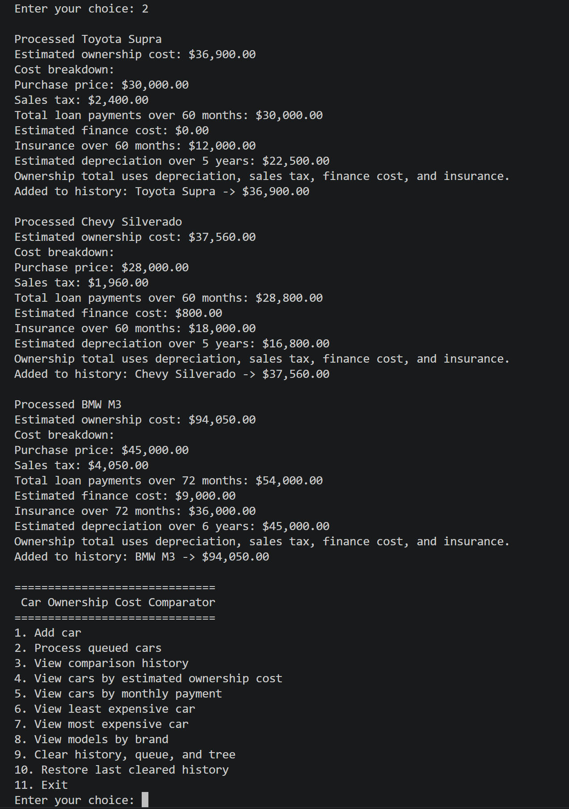
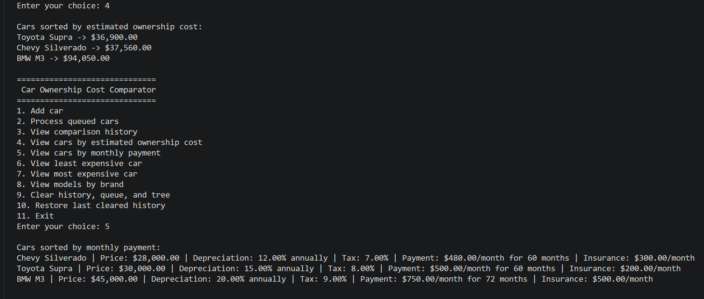

# Car Purchase Comparison Tool

A **solo Java console application** for comparing vehicle ownership costs using factors such as purchase price, depreciation, sales tax, financing cost, and insurance. Originally developed in a **Data Structures course**, this tool demonstrates how core data structures and algorithms can be applied to a practical cost-comparison problem.

## Overview

Buying a car involves more than just comparing sticker prices. This application helps users evaluate and compare vehicles based on estimated ownership cost, making it easier to see how financing, taxes, depreciation, and insurance affect the total cost of ownership.

## Key Features

- Compare vehicles by estimated ownership cost
- Add and process cars through a menu-driven console interface
- View comparison history
- Sort cars by estimated ownership cost
- Sort cars by monthly payment
- View the least and most expensive cars
- Search models by brand
- Restore the most recently cleared history snapshot
- Validate user input for safer interaction

## Technologies

- Java
- IntelliJ IDEA

## Data Structures and Algorithms Used

- **ArrayList** for sorting and displaying cars by monthly payment
- **LinkedList** for storing comparison history
- **Queue** for processing car calculations in insertion order
- **HashMap** for organizing and searching models by brand
- **Binary Search Tree** for ordering cars by estimated ownership cost
- **Bubble Sort** for monthly payment comparison

## Project Structure

~~~text
carcomparison/
├── CarComparisonApp.java
├── CarDetails.java
├── CarComparisonHistory.java
└── CarCostBinaryTree.java
~~~

## How It Works

Each car entry includes:
- car name
- purchase price
- depreciation rate
- sales tax rate
- monthly payment
- loan length
- monthly insurance cost

The estimated ownership total is based on:
- depreciation over the ownership period
- one-time sales tax
- estimated finance cost
- insurance over the loan term

To avoid double-counting the vehicle price, the program displays total loan payments for reference but uses **estimated finance cost** in the ownership total instead of adding the full loan principal again.

## How to Run

1. Open the project in IntelliJ IDEA or another Java IDE.
2. Make sure the source files are inside the `carcomparison` package.
3. Compile and run `CarComparisonApp.java`.
4. Use the console menu to enter cars and compare results.

## Screenshots

### Cost Processing and Ownership Breakdown

### Sorting by Ownership Cost and Monthly Payment

## Why This Project Matters

This project highlights:
- practical Java programming
- menu-driven application design
- structured cost analysis
- applied use of fundamental data structures
- input validation and cleaner console-based UX

It also shows how data structures can be used in a project with a real-world decision-making use case rather than only in isolated academic exercises.

## Improvements from the Initial Version

- Refactored into separate Java files with cleaner class names
- Improved cost-calculation consistency
- Replaced misleading variable names
- Improved `Scanner` and input handling
- Added safer brand/model parsing
- Formatted currency output more cleanly
- Fixed history restore behavior

## What I Learned

- How to apply core data structures to a practical Java application
- How to organize logic across multiple classes instead of one large file
- How to improve input validation and overall program reliability
- How to design comparison features around a real-world decision problem

## Future Improvements

- Add file save/load support
- Expand cost comparison factors
- Support down payments and more detailed financing inputs
- Improve reporting and export options
- Add unit tests

## Author

**Rushil Shanmugam**
